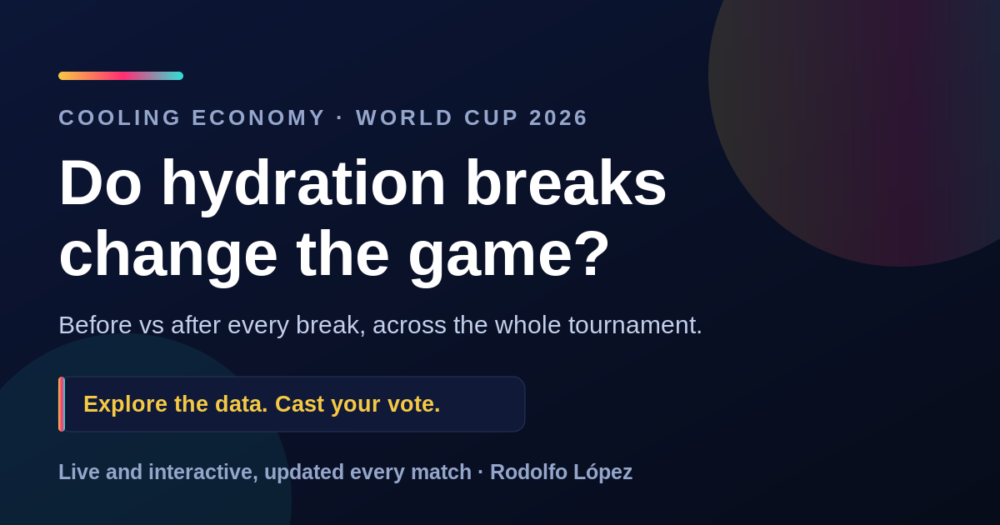

# Cooling Economy

**Do hydration breaks change the game?** A live, self-updating dashboard that tests whether the mandatory cooling breaks at the 2026 FIFA World Cup actually change how matches play out.

### [Open the live dashboard →](https://rograph.github.io/cooling-economy/)



---

## The question

At the 2026 World Cup, most matches stop twice for a short cooling break so players can drink and cool down in the heat, once in each half. Broadcasters and coaches treat these pauses as a reset. This project asks a plain question and answers it with data: do the breaks change the football?

For every match it measures goals, chance quality, possession, momentum, cards and substitutions in the ten minutes on each side of each break, pools the result across the whole tournament, and keeps a running verdict that updates as matches are played.

## What the data says so far

Through the round of 16, matches with cooling breaks look statistically indistinguishable from matches without them. Scoring in the ten minutes after a break is about even with the ten minutes before, the same pattern shows up in hot games and cooler ones, and the 2026 numbers track the no-break 2018 and 2022 World Cups closely. The live Verdict tab carries the current call, a 95% confidence band, and the honest caveats. Findings update automatically as the knockouts finish, so the dashboard is the source of truth, not this README.

## What is on the dashboard

- **Home** - the headline verdict and the key numbers at a glance.
- **Analysis** - per-match and pooled views: a stadium heat map, before/after break tables, possession and momentum shifts, goal timing, chance quality (xG), substitutions, player welfare, and a heat-versus-goals scatter. Filter by round or by heat.
- **Verdict** - the current call with a confidence band that tightens as the sample grows.
- **Bracket** - the knockout path, filling in as it is played.
- **Survey** - what fans felt, pooled live, set against what the data shows.
- **About** - data sources, method and limitations in plain language.

English and Spanish, light and dark, Celsius and Fahrenheit.

## How it works

```
ESPN public API  ──┐
                   ├──▶  update.py  ──▶  SQLite store  ──▶  build_dashboard.py  ──▶  index.html
Open-Meteo (WBGT) ─┘         ▲                                                          │
                             │                                                          ▼
                    GitHub Actions (daily cron) ──────────────────────────▶   GitHub Pages
```

An automated job runs twice a day. It pulls newly finished matches and their events from ESPN's public football API, estimates the real-feel heat (WBGT) at each stadium from Open-Meteo temperature and humidity, appends everything to a growing SQLite store, recomputes every panel, and republishes the static site. Nothing is entered by hand. A missed run self-heals, because the updater rescans a rolling window rather than only the previous day.

## Method, briefly

Three comparisons run side by side: before versus after each break within the same match, which cancels out team quality; hot games versus cooler ones, to separate a break effect from a heat effect; and 2026 with breaks against 2018 and 2022 without them. Effect sizes come with confidence intervals, and thin or uncertain numbers are labeled as such rather than overstated. This is observational, not a controlled experiment, so heat and breaks travel together and early samples are read lightly.

## Tech

- **Python standard library only** for the updater and the site builder, so it runs in CI with no dependencies and no API keys.
- **SQLite** for the persistent per-match store.
- **Vanilla HTML, CSS and JavaScript** with Chart.js for a single self-contained page.
- **GitHub Actions** for the scheduled pipeline, **GitHub Pages** for hosting.
- **Supabase** for the shared, live fan survey.

## Data sources

- Match events and possession: ESPN public football API.
- Weather for the WBGT estimate: Open-Meteo hourly forecast API.
- No-break baselines: 2018 and 2022 World Cups.

---

Built by **Rodolfo López**. More work at [rodolfo.app](https://rodolfo.app) · [LinkedIn](https://www.linkedin.com/in/rdflopez).
# cooling-economy
Do World Cup 2026 hydration breaks change the game Interactive data dashboard.
